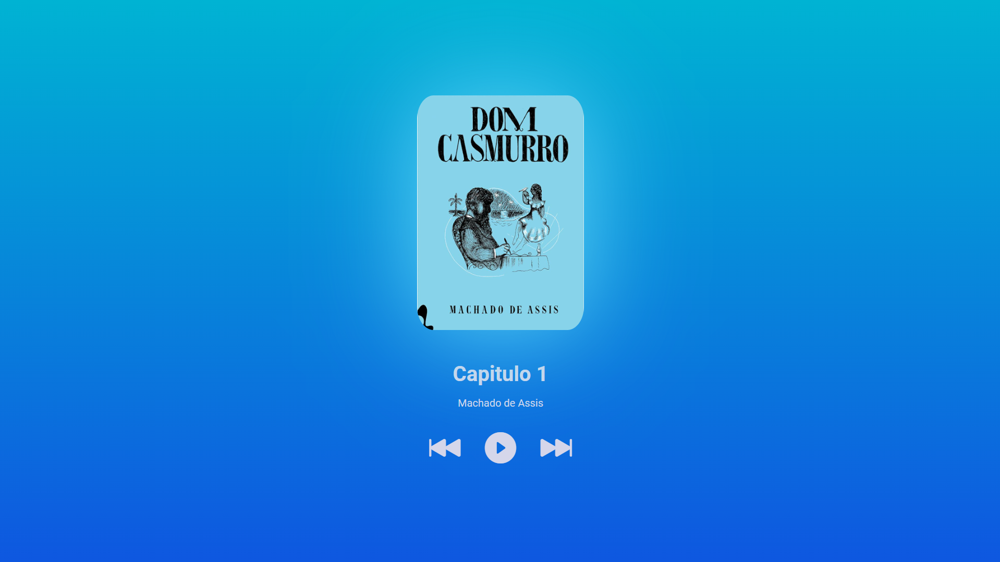

<h1 align="center"> Audio book </h1>

Project developed during the Hashtag Programação event.

  <a href="#-Technologies">Technologies</a>&nbsp;&nbsp;&nbsp;|&nbsp;&nbsp;&nbsp;
  <a href="#-Project">Project</a>&nbsp;&nbsp;&nbsp;|&nbsp;&nbsp;&nbsp;
  <a href="#memo-License">License</a>&nbsp;&nbsp;&nbsp;|&nbsp;&nbsp;&nbsp;

  

 

  

## 🚀 Technologies

This project was developed using the following technologies:

- JavaScript
- HTML5
- CSS3

## 💻 Project

The Audio Book is an audio platform designed for the experience of listening to book chapters. Developed in JavaScript, the platform offers dynamic and engaging interaction for users, allowing easy navigation between audio tracks, both forward and backward.

## :memo: License

This project is under the MIT license.

---

